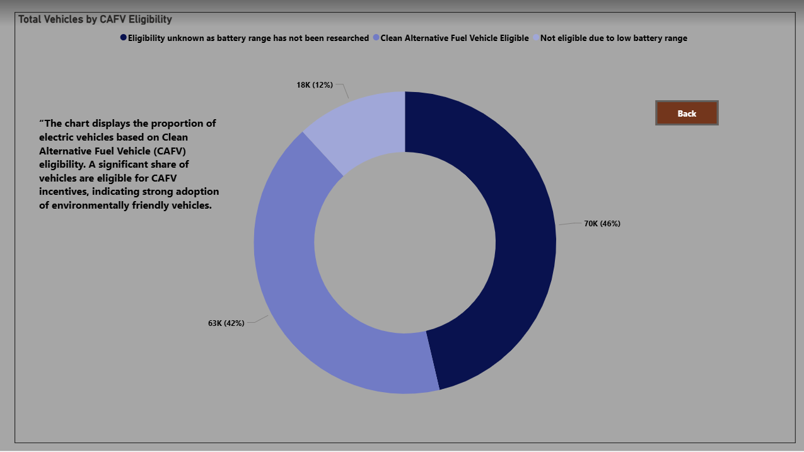

## Dashboard Overview

This dashboard analyzes electric vehicle adoption trends, vehicle types, and manufacturer distribution using Power BI.

Key Insights

The Dashboard shows the overall market of electric vehicles. There is a split between Battery Electric Vehicle and Hybrid Electric Vehicle(PHEV) and their respective percentage shows the relative dominance of Battery Electric Vehicle and Hybrid Electric Vehicle.
There is a growth from 2011 onwards in year wise analysis chart,which indictaed a rapid growth in electric vehicles adoption. 
State wise distribution shows clear regional patterns of usage of Electric Vehicles.
Top 10 manufactures highlights the top 10 makers of Electric Vehicles, while top 10 model indicates which model is being preferred by customers. It means both charts indicates that brand dominance and model popularity.
The CAFV eligibility analysis further explains how many vehicles qualify for clean alternative fuel incentives, indicating the potential influence of policy and incentive programs on electric vehicle adoption.
Total Vehicles by Electric Range Bin explains that the electric vehicle market is dominated by low-range vehicles, indicating strong adoption of short-distance and city-focused electric mobility. High-range vehicles form the second largest segment, while medium-range vehicles contribute the least.
Overall, the dashboard demonstrates strong market growth, regional concentration, dominance of a few key manufacturers and models, and a significant role of incentive eligibility in supporting the transition toward cleaner transportation.
